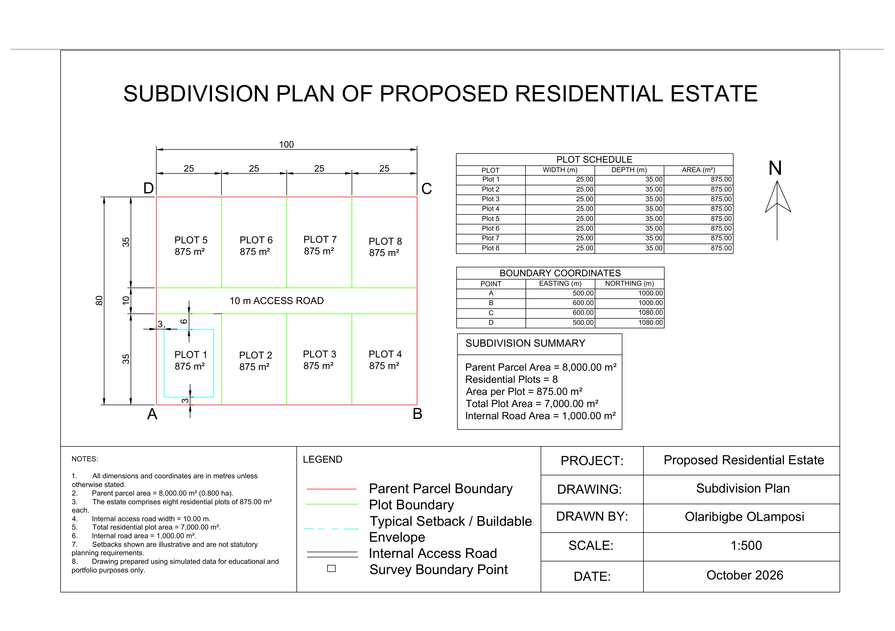

# Residential Estate Subdivision Plan — AutoCAD

## Project Overview

This project presents a simulated residential estate subdivision plan developed in AutoCAD.

The project demonstrates the subdivision of a parent parcel into eight residential plots with an internal access road, boundary coordinates, plot dimensions, plot areas, an illustrative building setback envelope, plot schedule, and technical drawing presentation.

The final drawing was prepared as an A3 technical sheet at a scale of 1:500.

---

## Final Drawing

---

## Project Details

- **Software:** AutoCAD
- **Drawing Type:** Residential Estate Subdivision Plan
- **Scale:** 1:500
- **Sheet Size:** A3 Landscape
- **Parent Parcel Dimensions:** 100 m × 80 m
- **Parent Parcel Area:** 8,000 m²
- **Parent Parcel Area:** 0.800 ha
- **Number of Residential Plots:** 8
- **Individual Plot Size:** 25 m × 35 m
- **Area per Plot:** 875 m²
- **Internal Access Road Width:** 10 m
- **Total Residential Plot Area:** 7,000 m²
- **Internal Road Area:** 1,000 m²

---
## Boundary Coordinates

| Point | Easting (m) | Northing (m) |
|---|---:|---:|
| A | 500.000 | 1000.000 |
| B | 600.000 | 1000.000 |
| C | 600.000 | 1080.000 |
| D | 500.000 | 1080.000 |

---

## Plot Schedule

| Plot | Width (m) | Depth (m) | Area (m²) |
|---|---:|---:|---:|
| Plot 1 | 25.00 | 35.00 | 875.00 |
| Plot 2 | 25.00 | 35.00 | 875.00 |
| Plot 3 | 25.00 | 35.00 | 875.00 |
| Plot 4 | 25.00 | 35.00 | 875.00 |
| Plot 5 | 25.00 | 35.00 | 875.00 |
| Plot 6 | 25.00 | 35.00 | 875.00 |
| Plot 7 | 25.00 | 35.00 | 875.00 |
| Plot 8 | 25.00 | 35.00 | 875.00 |

---

## Subdivision Summary

The original 8,000 m² parcel was divided into:

- **8 residential plots**
- **875 m² per plot**
- **7,000 m² total residential plot area**
- **1,000 m² internal access road area**

Therefore:

**7,000 m² + 1,000 m² = 8,000 m²**

This confirms that the subdivision area balances with the original parent parcel.

---

## Typical Buildable Envelope

Plot 1 was used to demonstrate an illustrative building setback arrangement.

The simulated setbacks used were:

- **Front setback:** 6 m
- **Rear setback:** 3 m
- **Left setback:** 3 m
- **Right setback:** 3 m

For a 25 m × 35 m plot:

**Buildable width:**

25 − 3 − 3 = **19 m**

**Buildable depth:**

35 − 6 − 3 = **26 m**

Therefore, the illustrative buildable envelope is:

**19 m × 26 m = 494 m²**

These setbacks are included for demonstration purposes only and do not represent statutory planning requirements.

---

## Workflow

The project was completed through the following stages:

1. Created a new AutoCAD drawing and configured drawing units.
2. Created separate layers for parent boundaries, plot boundaries, roads, dimensions, text, setbacks, and annotations.
3. Plotted the parent parcel using Easting and Northing coordinates.
4. Created the 100 m × 80 m parent parcel.
5. Designed a 10 m-wide internal access road through the estate.
6. Divided the parcel into eight residential plots.
7. Verified each plot as 25 m × 35 m.
8. Calculated the area of each plot as 875 m².
9. Added plot numbers and area labels.
10. Added plot dimensions and overall estate dimensions.
11. Added survey corner labels and boundary coordinates.
12. Created a plot schedule.
13. Created a subdivision summary.
14. Added an illustrative buildable envelope to Plot 1.
15. Added the north arrow, legend, notes, and technical annotations.
16. Prepared the final A3 Paper Space layout.
17. Set the drawing scale to 1:500.
18. Prepared the drawing for PDF plotting and portfolio presentation.

---

## AutoCAD Features Used

- Coordinate input
- LINE
- POLYLINE
- RECTANGLE
- OFFSET
- TRIM
- Object Snap
- Layers
- MTEXT
- Dimensions
- Tables
- Linetypes
- Paper Space
- Viewports
- Plotting
- Lineweights

---

## Skills Demonstrated

This project demonstrates practical experience with:

- AutoCAD 2D drafting
- Cadastral and subdivision drafting
- Coordinate-based drawing
- Parcel subdivision
- Plot area calculation
- Plot scheduling
- Boundary coordinate presentation
- Internal road layout
- Setback and buildable-envelope representation
- Layer management
- Technical annotation
- Paper Space layout
- Viewport scaling
- Technical drawing presentation

---

## Project Files

This repository contains:

- `Residential_Estate_Subdivision_Plan.dwg` — editable AutoCAD drawing
- `Residential_Estate_Subdivision_Plan_Final.pdf` — final A3 technical drawing
- `Residential_Estate_Subdivision_Plan_Preview.png` — portfolio preview image

---

## Key Learning Outcomes

Through this project, I improved my ability to develop a residential subdivision layout from coordinate-defined parcel boundaries.

I also gained practical experience in parcel division, plot-area calculations, access-road planning, plot scheduling, setback representation, layer management, technical annotation, and professional AutoCAD sheet preparation.

---

## Disclaimer

This project was created using simulated data for educational and portfolio purposes.

The subdivision layout and setbacks shown are illustrative only and should not be interpreted as approved planning standards, statutory setback requirements, or a legally certified cadastral survey.

---

## Author

**Olaribigbe Olamiposi**

Surveying & Geo-Informatics  
AutoCAD | GIS | Geospatial Analysis
